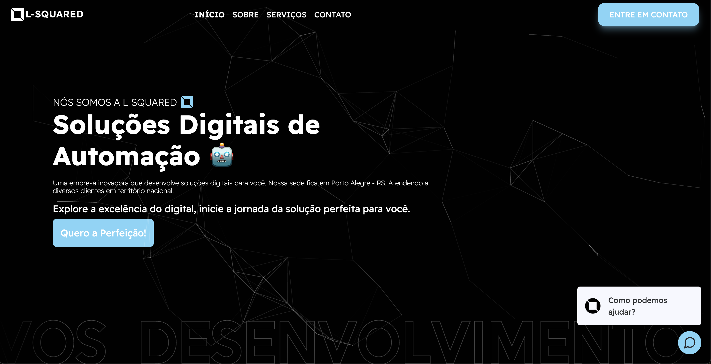

# Website for a Company that Develops IT Solutions (Fictitious)

<h1 align="center">
    
</h1>

## Technologies Used

-   **React:** A JavaScript library for building user interfaces, allsowing the creation of reusable and efficient components.

-   **Next.js:** A React framework that enables server-side rendering, simple routing, and other useful features for developing modern web applications.

## Installation

1. Make sure you have Node.js installed on your system.
2. Clone this repository using the `git clone` command.
3. Navigate to the project directory in the terminal.
4. Install dependencies using the `yarn install` command.
5. Configure the necessary environment variables for accessing the MySQL database.
6. Start the development server with the `yarn run dev` command.
7. The portal will be available at `http://localhost:3000`.

## Contribution

Contributions are welcome! If you encounter any issues or have suggestions for improvements, please open an issue or submit a pull request.

## License

This fictitious project is licensed under the [MIT License](LICENSE).
